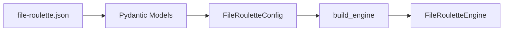
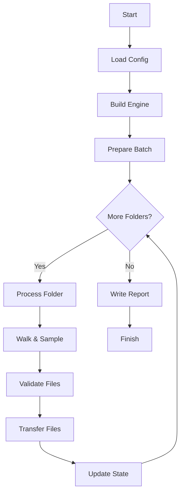

# Architecture

File Roulette uses a three-layer architecture to separate concerns and enable both CLI and GUI frontends.

## Design Principles

### Core Layer
The **core** layer (file_roulette.core) contains all business logic:

- **Engine** ([engine](./core/engine.md)): Orchestrates the file transfer workflow
- **Builder** ([builder](./core/builder.md)): Dependency injection factory
- **Walker** ([walker](./core/walker.md)): Random filesystem navigation with caching
- **Validator** ([validator](./core/validator.md)): File filtering (extension, keyword, size, duration)
- **Quota** ([quota](./core/quota.md)): Diversity and uniqueness constraints
- **Reporter** ([reporter](./core/reporter.md)): Report generation
- **Transfer** ([transfer](./core/transfer.md)): Transfer mode strategies (copy/move/link)

### Config Layer
The **config** layer (file_roulette.config) manages configuration:

- **Schemas** ([schemas](./config/schemas.md)): Pydantic models for JSON validation
- **Config** ([config](./config/config.md)): Dataclass conversion and management

### Frontend Layer
Two independent frontends share the core engine:

- **CLI** ([cli](./cli/cli.md)): Terminal interface using cyclopts
- **GUI** ([gui](./gui/gui.md)): PySide6 QtWidgets interface

## Observer Pattern

The core engine communicates with frontends via the `FileRouletteObserver` protocol ([interfaces](./utils/interfaces.md)):

### Implementations

- **CLI**: `ConsoleObserver` prints to stdout
- **GUI**: `GuiObserver` emits Qt signals to update UI

## Data Flow

1. **Configuration**: JSON → Pydantic validation → `FileRouletteConfig` dataclass
2. **Engine Build**: `build_engine()` wires all dependencies
3. **Execution**: `File RouletteEngine.start()` → process folders → validate → transfer files
4. **Reporting**: Generate reports in output directories

## Key Design Patterns

### Dataclasses with Slots
All core classes use `@dataclass(slots=True)` for memory efficiency:

```python
@dataclass(slots=True)
class FileRouletteEngine:
    config: FileRouletteConfig
    validator: FileValidator
    # ... more fields
```

### State Management
- `DiversityQuota`: Tracks locked files/folders for uniqueness
- `FolderStats`: Accumulates bytes and timing per folder
- Both have reset methods for between folders

## Thread Safety

The GUI uses Qt's threading model:

- Main thread: UI rendering and event handling
- Worker thread: Engine execution (see [workers](./gui/workers.md))
- Signals/slots: Thread-safe communication

## Configuration Flow



## Execution Flow


