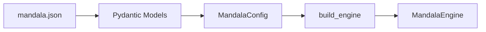
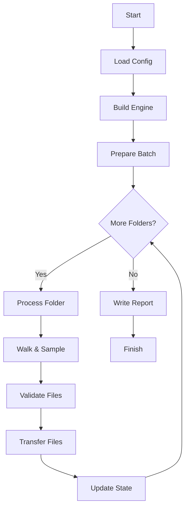

# Architecture Overview

Mandala uses a three-layer architecture to separate concerns and enable both CLI and GUI frontends.

## Design Principles

### Core Layer
The **core** layer ([mandala/core/](https://github.com/wonyoung-jang/mandala/tree/main/mandala/core)) contains all business logic:

- **Engine** ([engine.py](engine.md)): Orchestrates the file transfer workflow
- **Builder** ([builder.py](builder.md)): Dependency injection factory
- **Walker** ([walker.py](walker.md)): Random filesystem navigation with caching
- **Validator** ([validator.py](validator.md)): File filtering (extension, keyword, size, duration)
- **Quota** ([quota.py](quota.md)): Diversity and uniqueness constraints
- **Reporter** ([reporter.py](reporter.md)): Report generation
- **Transfer** ([transfer.py](transfer.md)): Transfer mode strategies (copy/move/link)

### Config Layer
The **config** layer ([mandala/config/](https://github.com/wonyoung-jang/mandala/tree/main/mandala/config)) manages configuration:

- **Schemas** ([schemas.py](schemas.md)): Pydantic models for JSON validation
- **Config** ([config.py](config.md)): Dataclass conversion and management

### Frontend Layer
Two independent frontends share the core engine:

- **CLI** ([cli.py](cli.md)): Terminal interface using cyclopts
- **GUI** ([mainwindow.md](mainwindow.md), [centralwidget.md](centralwidget.md)): PySide6 Qt interface

## Observer Pattern

The core engine communicates with frontends via the `MandalaObserver` protocol ([interfaces.md](interfaces.md)):

```python
class MandalaObserver(ABC):
    @abstractmethod
    def on_progress_total(self, maximum: int) -> None: ...
    @abstractmethod
    def on_log(self, msg: str) -> None: ...
    # ... more progress callbacks
```

**Implementations:**
- CLI: `ConsoleObserver` prints to stdout
- GUI: `GuiObserver` emits Qt signals to update UI

## Data Flow

1. **Configuration**: JSON → Pydantic validation → `MandalaConfig` dataclass
2. **Engine Build**: `build_engine()` wires all dependencies
3. **Execution**: `MandalaEngine.start()` → process folders → validate → transfer files
4. **Reporting**: Generate timestamped reports in output directories

## Key Design Patterns

### Dataclasses with Slots
All core classes use `@dataclass(slots=True)` for memory efficiency:

```python
@dataclass(slots=True)
class MandalaEngine:
    config: MandalaConfig
    validator: FileValidator
    # ... more fields
```

### Strategy Pattern
Transfer modes (copy, move, symlink, hardlink) implement a common protocol:

```python
class TransferStrategy(Protocol):
    def execute(self, src: Path, dst: Path) -> None: ...
```

### State Management
- `DiversityQuota`: Tracks locked files/folders for uniqueness
- `MandalaState`: Accumulates bytes and timing per folder
- Both reset between batches for reproducibility

## Thread Safety

The GUI uses Qt's threading model:
- Main thread: UI rendering and event handling
- Worker thread: Engine execution (see [workers.md](workers.md))
- Signals/slots: Thread-safe communication

## Configuration Flow



## Execution Flow


